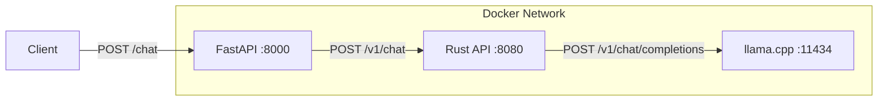

# llama.cpp FastAPI Rust Chat

A multi-tiered chat application demonstrating the integration of **FastAPI**, **Rust (Actix-Web)**, and **llama.cpp** to serve LLM requests efficiently on ARM64 (Raspberry Pi) and other architectures.

## Project Architecture

This project uses a microservices architecture to process chat requests:

1.  **FastAPI (Python)**: Acts as the public-facing API gateway / frontend backend.
2.  **Rust API (Actix-Web)**: Acts as a middleware service. It implements a semaphore to strictly serialize requests (1 at a time) before forwarding them to llama.cpp.
3.  **llama.cpp**: The LLM server hosting a Llama 3.2 GGUF model via an OpenAI-compatible API.



## Prerequisites

- [Docker](https://www.docker.com/)
- [Docker Compose](https://docs.docker.com/compose/)

## Getting Started

1.  **Clone the repository**:
    ```bash
    git clone <repository-url>
    cd ollama-fastAPI-rust-chat
    ```

2.  **Start the services**:
    ```bash
    docker compose up --build
    ```
    *This will start all three containers. On the first run, the `llama-cpp` container will download the Llama 3.2 1B GGUF model (~700MB) to the `./models` directory.*

3.  **Access the API**:
    The main endpoint is exposed via FastAPI on port `8000`.

## API Usage

### Chat Endpoint

**URL**: `http://localhost:8000/chat`
**Method**: `POST`

**Request Body**:
```json
{
  "prompt": "Why is the sky blue?",
  "refusal_message": "Custom refusal if blocked",
  "messages": []
}
```

**Response**:
```json
{
  "response": "The sky appears blue because of..."
}
```

**Example Request (Curl)**:
```bash
curl -X POST http://localhost:8000/chat \
     -H "Content-Type: application/json" \
     -d '{"prompt": "Why is the sky blue?"}'
```

## Component Details

### 1. FastAPI Service (`server/FastAPI`)
- **Port**: 8000
- **Framework**: FastAPI
- **Responsibility**: Validates client requests, applies content filters (Keyword and LLM-Guard), and proxies requests to the Rust service.
- **Config**: Supports passing custom `refusal_message` and conversation `messages` history.

### 2. Rust Service (`server/RUST_TAURI`)
- **Port**: 8080
- **Framework**: Actix-Web
- **Key Feature**: Implements a `Semaphore(1)` to ensure only one request is processed by the LLM at a time, preventing overload on resource-constrained devices like Raspberry Pi.
- **Path**: `/v1/chat` (forwards to `/v1/chat/completions` on llama.cpp)

### 3. llama.cpp Service
- **Port**: 11434
- **Model**: `Llama-3.2-1B-Instruct` (GGUF format)
- **Image**: `ghcr.io/ggml-org/llama.cpp:server` (multi-arch support including ARM64)
- **Persistence**: Models are stored in the `./models` directory on the host.

## License

[MIT](LICENSE)
